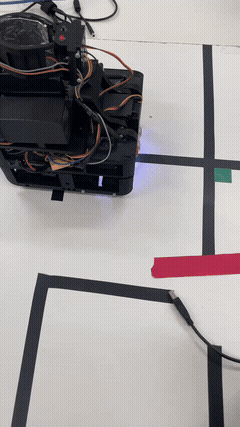
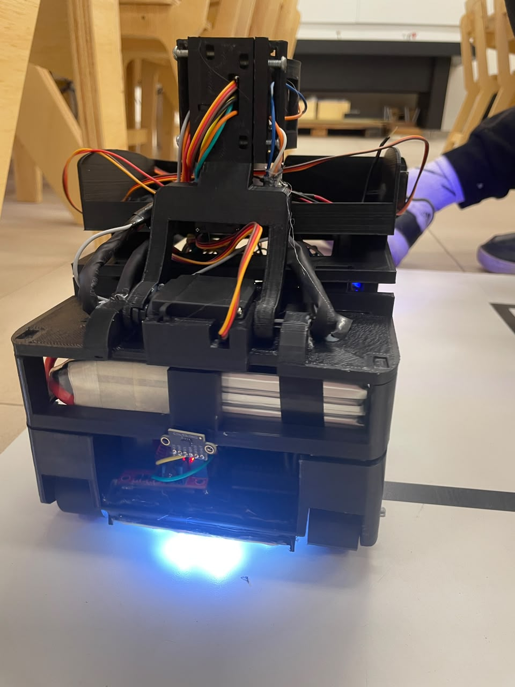
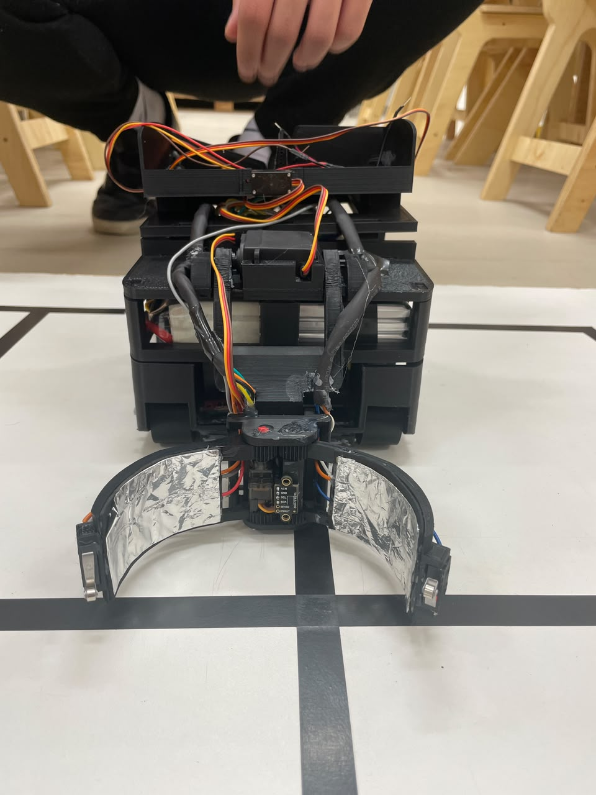
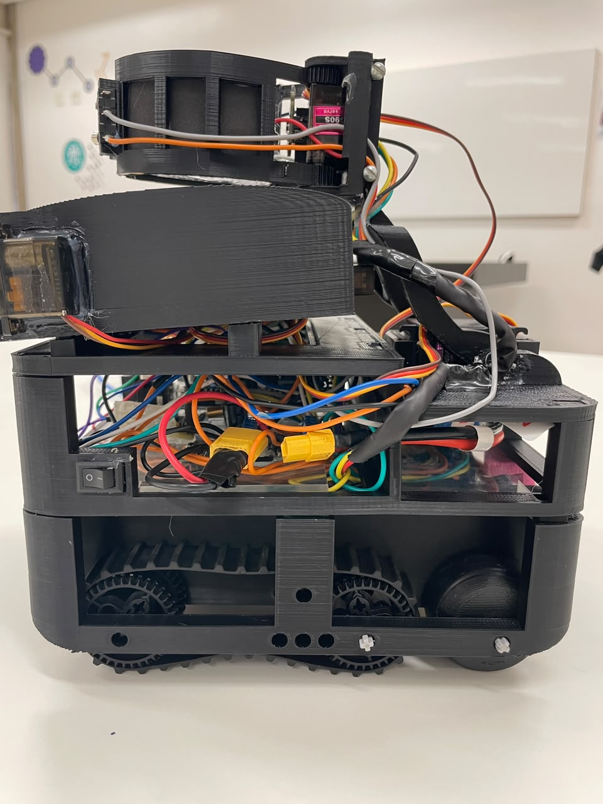
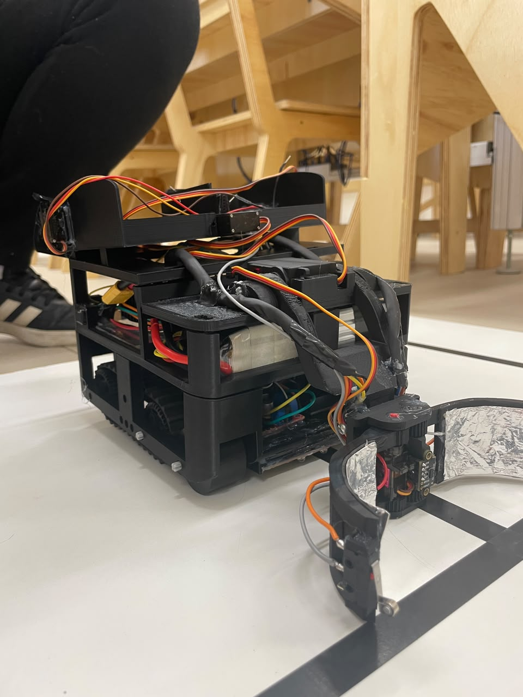
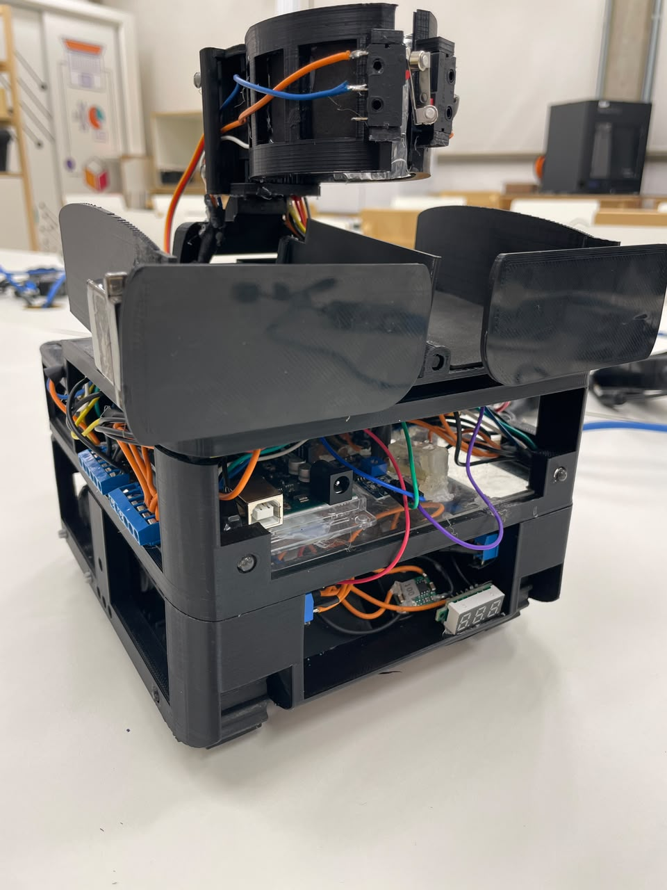

# Robô de Resgate — OBR Nível 2

Código-fonte do robô autônomo desenvolvido pela equipe **Olimpianos da Robótica** (SESI) para a Olimpíada Brasileira de Robótica (OBR), categoria Nível 2 — modalidade Resgate.

> Este repositório contém o código da **temporada 2024**. O robô segue linha, desvia de obstáculos, sobe/desce rampas e navega em uma arena fechada em busca da saída.

## Índice

- [Resultados da equipe](#resultados-da-equipe-2025)
- [Sobre o projeto](#sobre-o-projeto)
- [Funcionalidades](#funcionalidades)
- [Demonstração](#demonstração)
- [Hardware (versão 2024)](#hardware-versão-2024)
- [Estrutura do código](#estrutura-do-código)
- [Limitações conhecidas](#limitações-conhecidas)
- [Evolução do projeto (2025)](#evolução-do-projeto-2025)
- [Fotos](#fotos)
- [Equipe](#equipe)
- [Tecnologias](#tecnologias)

## Resultados da equipe (2025)

| Conquista | Evento | Local | Data |
|---|---|---|---|
| 1º Lugar — Classificação Regional | OBR | São Carlos, SP | Jun/2025 |
| Prêmio de Inovação — Etapa Estadual | OBR | São Bernardo do Campo, SP | Ago/2025 |

Resultados obtidos na temporada 2025, já com a estratégia e o hardware descritos na seção [Evolução do projeto](#evolução-do-projeto-2025).

## Sobre o projeto

O robô compete na modalidade Resgate da OBR, que exige navegação autônoma por um percurso com linha guia, obstáculos, rampas e uma arena fechada onde vítimas simuladas devem ser localizadas. Esta versão do código (2024) resolve a navegação completa até a arena; a lógica de leitura e resgate das vítimas dentro da arena não chegou a ser programada nesta temporada — a ideia inicial era apenas sair da arena o quanto antes para pontuar com os ladrilhos seguintes.

## Funcionalidades

- Seguimento de linha por reflectância (5 sensores infravermelhos ITR9909)
- Desvio de obstáculos via sensores ultrassônicos (frente, direita, esquerda)
- Subida e descida de rampas, com ajuste automático de velocidade a partir de sensores de inclinação
- Navegação em arena fechada, com busca de saída pelas paredes
- Leitura de marcações coloridas (verde/vermelho) em cruzamentos, via sensores de cor
- Feedback de estado em tempo real por LEDs RGB

## Demonstração

Trecho de um dos testes: o robô segue a linha reta, resolve um cruzamento e erra a leitura de um cruzamento com verde duplo, executando um giro de 180° incorreto.

> Vídeo completo (8 min), com trechos de treino, competição e fotos da equipe, disponível [no YouTube](https://www.youtube.com/watch?v=-bZrO-2TM4Q).

## Hardware (versão 2024)

| Componente | Função |
|---|---|
| Arduino Mega 2560 | Controlador principal |
| Ponte H L298N | Acionamento dos motores |
| 5x sensores de reflectância ITR9909 | Leitura da linha guia |
| 2x sensores de cor APDS-9960 | Identificação de marcações verde/vermelho |
| Multiplexador | Uso conjunto dos sensores de cor no mesmo barramento |
| 3x sensores ultrassônicos HC-SR04 | Detecção de obstáculos e paredes (frente, direita, esquerda) |
| 2x sensores de mercúrio | Detecção de inclinação (rampas) |
| 2x sensores de toque | Referência de posição dentro da arena |
| 2x LEDs RGB | Feedback visual de estado |
| Bateria 12V | Alimentação autônoma do robô |
| 2x reguladores de tensão (com diodo) | Proteção contra curto-circuito e corrente excessiva |

## Estrutura do código

O Arduino IDE compila todos os arquivos `.ino` de uma mesma pasta como um único programa; a divisão abaixo separa o código por responsabilidade:

| Arquivo | Responsabilidade |
|---|---|
| `OLIMPIANOS_2024.ino` | `setup()`, `loop()` e definição de pinos/variáveis globais |
| `segue_linha.ino` | Lógica principal de seguimento de linha |
| `cruzamento.ino` | Identificação e tratamento dos tipos de cruzamento |
| `identificaVerde.ino` | Leitura e média dos sensores de cor |
| `arena.ino` | Entrada, busca de saída e navegação na arena |
| `obstaculo.ino` | Desvio de obstáculos (normal e em 90°) |
| `rampa.ino` | Subida e descida de rampas |
| `ultra.ino` | Leitura dos sensores ultrassônicos |
| `motores.ino` | Controle de movimento (avançar, recuar, curvas) |
| `leitura.ino` | Leitura consolidada dos sensores |
| `situacaoAt.ino` | Controle dos LEDs de feedback |

## Limitações conhecidas

Grande parte do código desta versão está em fase de teste. Ele registra a equipe em um processo contínuo de testes e evolução, e serviu de base para as implementações da temporada seguinte. Uma revisão técnica posterior identificou os seguintes pontos:

- **Desvio de obstáculo em 90°** (identificado nos testes de 2024): a condição de saída do laço depende do sensor frontal detectar a linha, mas nessa etapa o robô está posicionado paralelamente a ela — a condição nunca é satisfeita. A função está desativada no código por uma flag de teste que não chegou a ser revertida.
- **`fim()`**: rotina de detecção da faixa de chegada, implementada mas não referenciada no `loop()` principal.

## Evolução do projeto (2025)

Na temporada seguinte, o projeto passou por mudanças estruturais que não estão refletidas neste repositório, tanto em lógica de programação quanto em hardware:

- **Correção de bugs**: revisão e correção dos bugs identificados na versão 2024.
- **Resgate de vítimas**: implementação da leitura da garra, que identificava vítimas vivas pelo contato elétrico gerado pelo revestimento de alumínio. Vítimas vivas eram entregues no triângulo verde da arena, e vítimas sem esse revestimento, no triângulo vermelho; a caçamba do robô direcionava cada uma conforme essa leitura.
- **Microcontrolador secundário**: avaliação de um ESP e, posteriormente, de um Arduino Nano para assumir a leitura dos sensores de cor de forma independente do Arduino Mega. A ideia ficou incompleta, mas os testes indicavam viabilidade técnica.
- **Estratégia de arena**: substituição da busca automática por lógica de decisão pré-mapeada via `switch-case` para o layout conhecido da arena.
- **Remodelagem geral do robô**: reposicionamento da garra para melhor distribuição de peso nas rampas, substituição da esteira por uma versão com maior aderência, ajustes no chassi e uma garra redesenhada com mais graus de liberdade e alcance.
- **Sensores ultrassônicos mais compactos** nas laterais do chassi.

## Fotos

As imagens abaixo documentam a montagem e evolução do robô, incluindo componentes já da versão 2025 (garra, chassi revisado).

*Vista frontal com o mecanismo de garra*

*Garra aberta, revestida com folha de alumínio*

*Vista lateral do chassi completo*

*Vista em perspectiva do robô montado*

*Detalhe da garra em posição de captura*

*Robô sobre a bancada de testes*

*LED indicador de leitura da linha*

*Vista traseira do robô*

## Equipe

A equipe foi formada por 3 integrantes na temporada 2024 — um a menos que o padrão das demais equipes — em um momento de baixo interesse dos estudantes e poucos recursos para a robótica na escola. O objetivo era mostrar resultados capazes de reverter esse cenário e motivar a participação de novos alunos. A equipe também competiu na modalidade virtual da OBR, tanto para contribuir com a retomada da robótica estudantil na unidade quanto para reunir referências técnicas sobre a competição, nas modalidades virtual e presencial.

Em 2025, os resultados obtidos permitiram integrar um quarto integrante à equipe, mais jovem, para repasse de conhecimento. Posteriormente, o interesse de mais 10 alunos levou a um processo seletivo, com atividades propostas pela própria equipe a partir da experiência acumulada nas competições.

## Tecnologias

`C/C++` · `Arduino IDE` · `Arduino Mega 2560`
